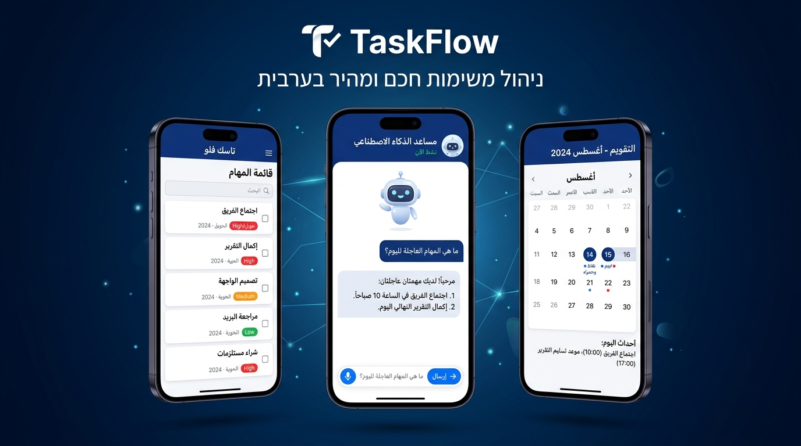
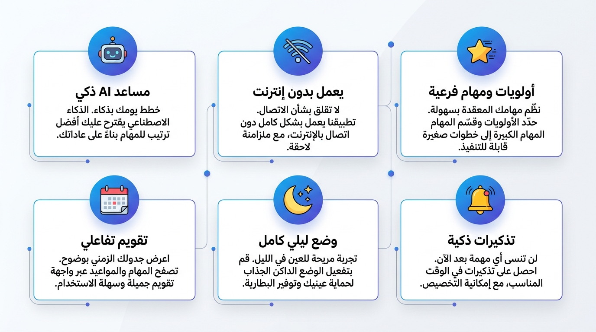

<div align="center">



<br/><br/>

[](https://github.com/mohammed-m-alhaj/taskflow/releases/latest)
[](https://github.com/mohammed-m-alhaj/taskflow/stargazers)
[](https://github.com/mohammed-m-alhaj/taskflow/issues)
[](LICENSE)

<br/>

### نظّم يومك — بالعربية — بالذكاء الاصطناعي — بدون إنترنت

</div>

---

## 📲 تحميل التطبيق — مباشرة

> **أندرويد فقط حالياً | Android 6.0+**

| النسخة | الحجم | متى أستخدمها؟ |
|--------|-------|----------------|
| [⬇️ **النسخة الخفيفة** *(موصى بها)*](https://github.com/mohammed-m-alhaj/taskflow/releases/download/v1.0.0/TaskFlow_Mobile_Optimized.apk) | ~19 MB | لأغلب الهواتف الحديثة |
| [⬇️ **النسخة الشاملة**](https://github.com/mohammed-m-alhaj/taskflow/releases/download/v1.0.0/TaskFlow_Universal.apk) | ~55 MB | إذا لم تعمل النسخة الخفيفة |

**كيف أثبّت التطبيق؟**
1. حمّل ملف الـ APK
2. افتح الملف من مجلد التنزيلات
3. اضغط **تثبيت** — وإذا ظهرت رسالة تحذير: اذهب إلى **الإعدادات ← الأمان ← السماح بمصادر غير معروفة**
4. افتح **TaskFlow** وابدأ فوراً 🚀

---

## ✨ المميزات — بالصور



<br/>

### 🤖 مساعد الذكاء الاصطناعي — النجم الرئيسي

اكتب أي هدف بالعربية العامية أو الفصحى — وسيحوّله التطبيق لخطة عمل مفصّلة:

```
أنت تكتب:  "أذاكر مادة قواعد البيانات للاختبار"

التطبيق يرد:
  ✅ مراجعة الفصل الأول — الأحد 3:00 م     [عالية]
  ✅ حل تمارين الفصل الثاني — الإثنين       [متوسطة]
  ✅ مراجعة شاملة — يوم قبل الاختبار        [عالية]
  ✅ نوم مبكر ليلة الاختبار                  [منخفضة]

  [+ أضف هذه المهام مباشرة للتطبيق]
```

> يعمل بـ **Google Gemini API** (مجاني) — وعند انعدام الاتصال يعمل بمحرك ذكاء محلي داخل التطبيق

---

## 👥 لمن هذا التطبيق؟

| الفئة | كيف يفيدهم TaskFlow؟ |
|-------|----------------------|
| 🎓 **الطلاب** | تنظيم جداول المذاكرة والمشاريع مع خطط AI مخصصة |
| 💼 **الموظفون** | تتبع المهام اليومية وترتيب الأولويات بسهولة |
| 🏢 **فرق العمل** | كل عضو يدير مهامه المستقلة بشكل منظم |
| 🏠 **الاستخدام الشخصي** | تذكيرات، مشتريات، أهداف يومية — كل شيء في مكان واحد |
| 👨‍💻 **المطورون** | مشروع مفتوح المصدر للتعلم والمساهمة |

---

## 🏗️ للشركات والمطورين — المعمارية التقنية

> هذا تطبيق **Full-Stack** مبني بمعايير إنتاجية احترافية

### المكونات

```
┌─────────────────────────────────────────────────────┐
│                    📱 Flutter App                   │
│                                                     │
│  Screens (12)  →  Providers (5)  →  Services (4)   │
│                                                     │
│  • Home          • AuthProvider      • AiService    │
│  • AI Assistant  • TaskProvider      • ApiService   │
│  • Calendar      • CategoryProvider  • DbHelper     │
│  • Tasks         • ReminderProvider  • Storage      │
│  • Settings      • SettingsProvider                 │
└──────────────────────┬──────────────────────────────┘
                       │ REST API (Dio/HTTP)
                       │
┌──────────────────────▼──────────────────────────────┐
│                  ⚙️ FastAPI Backend                 │
│                                                     │
│  Routers:  auth · tasks · subtasks                  │
│            categories · reminders · settings        │
│                                                     │
│  Stack: FastAPI + SQLAlchemy + Pydantic + Uvicorn   │
└─────────────────────────────────────────────────────┘
```

### التقنيات

| الطبقة | التقنيات |
|--------|----------|
| **UI** | Flutter 3 · Dart 3 · Material Design 3 · RTL عربي كامل |
| **State** | Provider 6 · MultiProvider pattern |
| **Network** | Dio 5 · RESTful API · JSON serialization |
| **Local DB** | SQLite (sqflite) — يعمل بدون إنترنت كلياً |
| **AI** | Google Gemini API + Local fallback engine |
| **Backend** | FastAPI · SQLAlchemy ORM · Pydantic v2 · Uvicorn |
| **Auth** | JWT Authentication · Session management |
| **UX** | Shimmer loading · Dark/Light theme · Arabic font (Thmanyah) |

### هيكل قاعدة البيانات

```sql
Users           ── حسابات المستخدمين والمصادقة
Tasks           ── المهام (أولوية، تاريخ، تكرار، حالة)
Subtasks        ── المهام الفرعية المرتبطة بكل مهمة
Categories      ── التصنيفات الملونة المخصصة
Reminders       ── التذكيرات المجدولة
RecurrenceRules ── قواعد التكرار التلقائي
CalendarEvents  ── أحداث التقويم
UserSettings    ── تفضيلات المستخدم (ثيم، إعدادات)
```

### API Endpoints

| Method | Endpoint | الوصف |
|--------|----------|-------|
| `POST` | `/auth/register` | تسجيل حساب جديد |
| `POST` | `/auth/login` | تسجيل الدخول + JWT |
| `GET` | `/tasks/` | جلب مهام المستخدم |
| `POST` | `/tasks/` | إنشاء مهمة جديدة |
| `PUT` | `/tasks/{id}` | تحديث مهمة |
| `DELETE` | `/tasks/{id}` | حذف مهمة |
| `GET/POST` | `/subtasks/` | المهام الفرعية |
| `GET/POST` | `/categories/` | التصنيفات |
| `GET/POST` | `/reminders/` | التذكيرات |
| `GET/PUT` | `/settings/` | إعدادات المستخدم |
| `GET` | `/health` | فحص حالة الخادم |

---

## 🚀 تشغيل المشروع محلياً

<details>
<summary><b>📱 Flutter Frontend</b> — اضغط لعرض التعليمات</summary>

**المتطلبات:** Flutter 3.x · Android Studio أو VS Code · جهاز أندرويد أو محاكي

```bash
# 1. استنسخ المشروع
git clone https://github.com/mohammed-m-alhaj/taskflow.git
cd taskflow

# 2. ثبّت الحزم
flutter pub get

# 3. شغّل على جهاز متصل أو محاكي
flutter run

# بناء APK
flutter build apk --release
# الناتج في: build/app/outputs/flutter-apk/app-release.apk
```

</details>

<details>
<summary><b>⚙️ FastAPI Backend</b> — اضغط لعرض التعليمات</summary>

**المتطلبات:** Python 3.9+

```bash
cd Backend

# إنشاء بيئة افتراضية
python -m venv venv
venv\Scripts\activate        # Windows
# source venv/bin/activate   # Linux/macOS

# تثبيت المتطلبات
pip install fastapi uvicorn sqlalchemy pydantic python-jose passlib

# تشغيل الخادم
uvicorn app.main:app --reload --host 0.0.0.0 --port 8000
```

بعد التشغيل:
- **API:** `http://localhost:8000`
- **توثيق Swagger:** `http://localhost:8000/docs`
- **ReDoc:** `http://localhost:8000/redoc`

</details>

<details>
<summary><b>🤖 تفعيل Gemini AI</b> — اضغط لعرض التعليمات</summary>

1. اذهب إلى [aistudio.google.com](https://aistudio.google.com/app/apikey)
2. أنشئ API Key مجاني
3. افتح TaskFlow ← **الإعدادات** ← **مفتاح AI**
4. الصق المفتاح واحفظ

بدون المفتاح يعمل التطبيق بمحرك ذكاء محلي — لكن مع المفتاح تكون الردود أذكى وأدق.

</details>

---

## 🗺️ خارطة الطريق

- [x] ✅ تطبيق Flutter كامل (12 شاشة)
- [x] ✅ Backend FastAPI مع كامل الـ API
- [x] ✅ مساعد AI بـ Gemini + محرك محلي احتياطي
- [x] ✅ دعم كامل للعربية RTL
- [x] ✅ وضع داكن/فاتح
- [ ] 📊 تقارير الإنتاجية الأسبوعية
- [ ] 🔄 مزامنة عبر أجهزة متعددة
- [ ] 📌 Widget للشاشة الرئيسية
- [ ] 🍎 إصدار iOS
- [ ] 🌐 واجهة إنجليزية

---

## 🤝 المساهمة في المشروع

المشروع مفتوح المصدر وكل مساهمة مرحّب بها:

```bash
# Fork ← Clone ← Branch ← Commit ← Push ← Pull Request
git checkout -b feature/اسم-الميزة
git commit -m "feat: وصف التعديل"
git push origin feature/اسم-الميزة
```

- 🐛 **أبلغ عن خطأ** → [فتح Issue](https://github.com/mohammed-m-alhaj/taskflow/issues)
- 💡 **اقترح ميزة** → [طلب جديد](https://github.com/mohammed-m-alhaj/taskflow/issues/new)

---

## 📄 الرخصة

هذا المشروع مرخّص تحت **MIT License** — يمكنك استخدامه، تعديله، ونشره بحرية كاملة.

---

<div align="center">

**إذا أفادك TaskFlow — نجمة واحدة ⭐ تساعد في وصوله لأشخاص أكثر!**

<br/>

[](https://github.com/mohammed-m-alhaj)
&nbsp;
[](https://github.com/mohammed-m-alhaj/taskflow/issues)

<br/>

*صُنع بـ ❤️ وكثير من ☕ — Flutter + FastAPI + AI*

</div>
